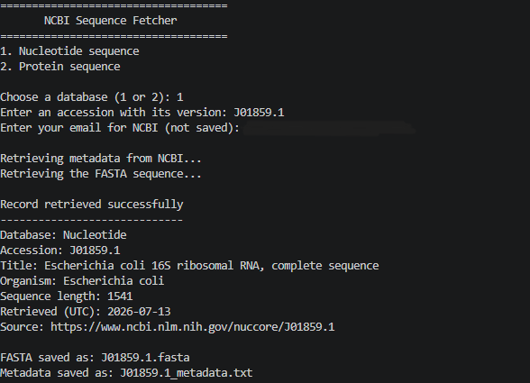

# NCBI Sequence Fetcher

NCBI Sequence Fetcher is a beginner-friendly Python program that retrieves one nucleotide or protein record from the National Center for Biotechnology Information (NCBI). A user supplies an accession number, and the program downloads the sequence in FASTA format and saves a separate metadata report.

This is the third project in my bioinformatics portfolio. It builds on local FASTA analysis by introducing programmatic access to a public biological database.

## Project objective

The project answers a practical question:

> How can a biological sequence and its identifying information be retrieved reproducibly from NCBI with Python?

## Features

- Retrieves nucleotide or protein sequences by accession number
- Preserves the exact accession version returned by NCBI
- Displays the record title, organism, sequence length, and retrieval date
- Saves the sequence as a FASTA file
- Saves a plain-text metadata report with the source URL
- Validates user input before contacting NCBI
- Retries temporary rate-limit and server problems
- Asks before replacing existing files
- Uses only Python's standard library

## Repository contents

```text
bioinformatics-project-02-ncbi-sequence-fetcher/
|-- ncbi_sequence_fetcher.py
|-- examples/
|   |-- nucleotide/
|   `-- protein/
|-- images/
|   `-- project_output.png
|-- requirements.txt
|-- .gitignore
|-- LICENSE
`-- README.md
```

## Requirements

- Python 3.10 or newer
- An internet connection
- A valid email address for NCBI E-utilities requests

No external Python packages are required.

## How to run

1. Open the repository folder in Visual Studio Code.
2. Open `ncbi_sequence_fetcher.py`.
3. Select **Run Python File**.
4. Choose the nucleotide or protein database.
5. Enter an accession including its version.
6. Enter your email when prompted.

You can also run the program from a terminal:

```powershell
python ncbi_sequence_fetcher.py
```

The email is included with the NCBI request as recommended by its E-utilities guidance. It is not displayed, written to an output file, or stored in this repository.

## Verified examples

### Nucleotide record

```text
Database: Nucleotide
Accession: J01859.1
```

J01859.1 is a complete *Escherichia coli* 16S ribosomal RNA gene record.

### Protein record

```text
Database: Protein
Accession: NP_000537.3
```

NP_000537.3 is the human cellular tumor antigen p53 isoform a reference protein.

Verified output files for both records are stored in the `examples` folder. Retrieval dates are recorded inside their metadata files.

## Example program output

```text
Record retrieved successfully
-----------------------------
Database: Nucleotide
Accession: J01859.1
Title: Escherichia coli 16S ribosomal RNA, complete sequence
Organism: Escherichia coli
Sequence length: 1541
Retrieved (UTC): 2026-07-13
Source: https://www.ncbi.nlm.nih.gov/nuccore/J01859.1

FASTA saved as: J01859.1.fasta
Metadata saved as: J01859.1_metadata.txt
```

The screenshot below shows the nucleotide example being retrieved successfully.
The email entered for the NCBI request has been hidden for privacy.



## Connection to the previous project

The downloaded `J01859.1.fasta` file was also opened successfully with my
[BioSeq Toolkit](https://github.com/pankhilpandya01-star/bioinformatics-project-00-seqtool).
This connects the portfolio workflow: one project retrieves a traceable record
from NCBI, and the earlier sequence-analysis tool can use the resulting FASTA
file as its input.

## Output files

For an accession such as `J01859.1`, the program creates:

```text
J01859.1.fasta
J01859.1_metadata.txt
```

The metadata report contains:

- Database
- Exact accession version
- Record title
- Organism
- Sequence length
- NCBI update date
- Retrieval date
- Public NCBI source URL

## Responsible NCBI access

The program identifies itself with the `tool` parameter and supplies the user's email with each request. Requests are made sequentially with a delay. Temporary HTTP 429 and server errors are retried up to three times with increasing pauses.

This project follows the official [NCBI E-utilities usage guidance](https://www.ncbi.nlm.nih.gov/books/NBK25497/) and uses [EFetch](https://www.ncbi.nlm.nih.gov/books/NBK25499/) to obtain records.

NCBI resources are provided by the National Library of Medicine. Users should also review the [NCBI Disclaimer and Copyright Notice](https://www.ncbi.nlm.nih.gov/home/about/policies/).

## Input and error handling

The program gives a readable message when:

- A menu choice is invalid
- An accession or email is missing
- An accession lacks a version number
- The accession is not present in the selected database
- NCBI cannot be reached
- NCBI returns a rate-limit or temporary server error
- Existing output files are not approved for replacement

Downloads are validated before files are written, so a failed request does not create incomplete sequence files.

## Testing

The project was checked with Python 3.14 on Windows. The input-validation,
database-selection, FASTA-validation, metadata-parsing, and output-formatting
functions were tested separately. The complete workflow was verified with the
nucleotide and protein accessions listed above.

## What I learned

- How accession numbers identify versioned biological database records
- How Python can make requests to NCBI E-utilities
- How XML metadata can be parsed into useful fields
- Why public APIs require responsible request rates and identification
- How sequence provenance improves reproducibility
- How to handle common network and input errors

## Limitations and future improvements

Version 1 retrieves one accession per run. Future versions could add keyword searching, batch retrieval, optional API keys, and integration with downstream sequence analysis tools.

## Portfolio Progression

Previous project: [FASTA Explorer](https://github.com/pankhilpandya01-star/bioinformatics-project-01-fasta-explorer)

Next project: [Restriction Site Finder](https://github.com/pankhilpandya01-star/bioinformatics-project-03-restriction-site-finder)

## License

This project is available under the MIT License.
